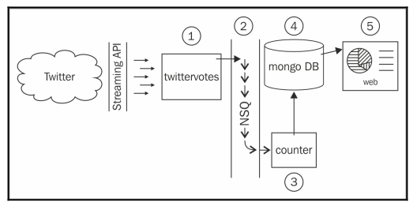

# socialPoll
distribute system with golang

# The system design

The preceding diagram shows the basic overview of the system we are going to build:
- Twitter is the social media network we all know and love.
- Twitter's streaming API allows long-running connections where tweet data is
streamed as quickly as possible.
- twittervotes is a program we will write that pulls the relevant tweet data via
the Twitter API, decides what is being voted for (rather, which options are
mentioned in the tweet body), and then pushes the vote into NSQ.
- NSQ is an open source, real-time distributed messaging platform designed to
operate at scale, built and maintained by Bit.ly. NSQ carries the message across
its instances, making it available to anyone who has expressed an interest in the
vote data.
- counter is a program we will write that listens out for votes on the messaging
  queue and periodically saves the results in the MongoDB database. It receives the
  vote messages from NSQ and keeps an in-memory tally of the results,
  periodically pushing an update to persist the data.
- MongoDB is an open source document database designed to operate at scale.
- web is a web server program that will expose the live results that we will write in
  the next chapter.